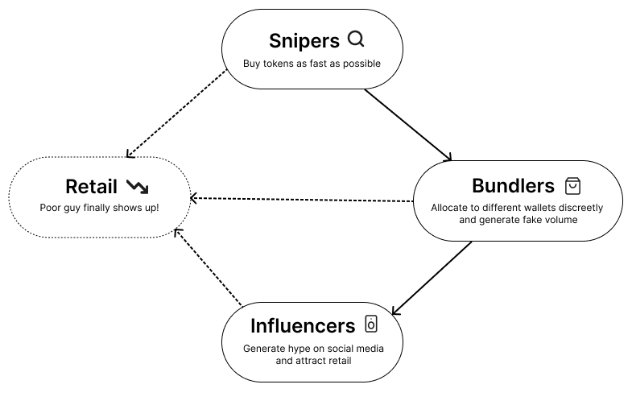

# Overview

Prysma is a token launch protocol designed to decrease market manipulation by changing the incentives around how tokens are launched and distributed.

Today, token launches often reward participants for getting positioned before everyone else. Creators, insiders, bots, and sophisticated traders compete for early allocation, while promoters are incentivized to attract subsequent buyers. And when retails finally shows up, everyone empties their bags on them.

This can create an **extractive cycle**:

Prysma takes a different approach. We recognize the importance of distributors and reward them for bringing value to the tokens. However, it must be done for the betterment of the overall ecosystem.

## The problem with token launches

The mechanism used to launch a token determines the incentives participants face from the very beginning.

Two approaches are particularly common.

### Instant launches

Instant launches open trading immediately.

This creates a race to be first. Bots and sophisticated traders compete for early transactions, while creators can potentially acquire positions before broader participation develops.

Mechanisms such as high initial transaction fees can discourage sniping, but they also penalize genuine early demand.

Instant launches also lack a discrete coordination event. Potential participants arrive independently, often waiting to see whether others will participate before committing themselves.

### Bonding curves

Bonding curves create stronger coordination and an explicit reason to participate early:

**Buy now because later participants will pay more.**

This can be extremely effective at generating momentum.

But the same mechanism creates a strong advantage for early participants. Price increases mechanically according to the curve, creating a reflexive incentive to acquire tokens before subsequent buyers arrive.

Prysma Launchpad aims to preserve the useful coordination properties of token launches without making **being early** the primary economic advantage.

## Why auctions

Auctions have an enormous body of research behind them—from the foundational work of Nobel Prize-winning economist Roger Myerson to Uniswap's more recent Continuous Clearing Auction (CCA) for token launches.

Rather than mechanically increasing price, an auction aggregates bids from participants and uses those bids to discover a clearing price.

Auctions therefore provide two properties that are particularly useful for token launches:

**Coordination.** Participants have a common event around which to organize their participation.

**Price discovery.** Price emerges from aggregate demand rather than being prescribed by a bonding curve.

Prysma Launchpad uses Uniswap's Continuous Clearing Auction as the foundation of its launch mechanism.

But auctions leave an important problem unresolved.

## The distribution problem

**Auctions can aggregate demand, but they don't necessarily create it.**

Bonding curves have a built-in distribution incentive. Early participants benefit when additional participants arrive at higher prices, giving them a strong reason to promote the token.

Auctions intentionally remove much of this dynamic.

That improves price discovery, but removes one of the mechanisms that encourages participants to bring others into the market.

Prysma Launchpad therefore treats **distribution as a separate part of the launch mechanism.**

## Incentivizing contribution

Prysma Launchpad allows participants to distribute launches through referral links.

When a distributor brings participants into an auction, the protocol tracks the bid volume they contribute.

Rather than paying a one-time referral bounty, Prysma Launchpad connects the distributor's reward to the market they helped create.

After a successful auction graduates into a Uniswap market, trading generates fees. A portion of those fees is distributed to contributors based on the economic activity they brought into the original auction.

This creates a different incentive:

**Find something worth supporting → bring participants → help create the market → participate in the value that market generates.**

The goal is to shift the economic advantage away from simply **being early** and toward **making a measurable contribution to the market.**

## What Prysma Launchpad is designed to solve

Prysma Launchpad does not attempt to guarantee that tokens will retain value or remain relevant indefinitely.

It also does not currently attempt to solve the question of what fundamental cash flows should support a token. Those are separate problems that may be addressed by future mechanisms.

Prysma Launchpad starts with a narrower question:

**Can better incentives make token markets harder to manipulate?**

Our approach combines auction-based price discovery with incentive-driven distribution to create token markets where contributing to growth is rewarded directly.

**Prysma Launchpad is designing manipulation-resistant token markets through better incentives.**
